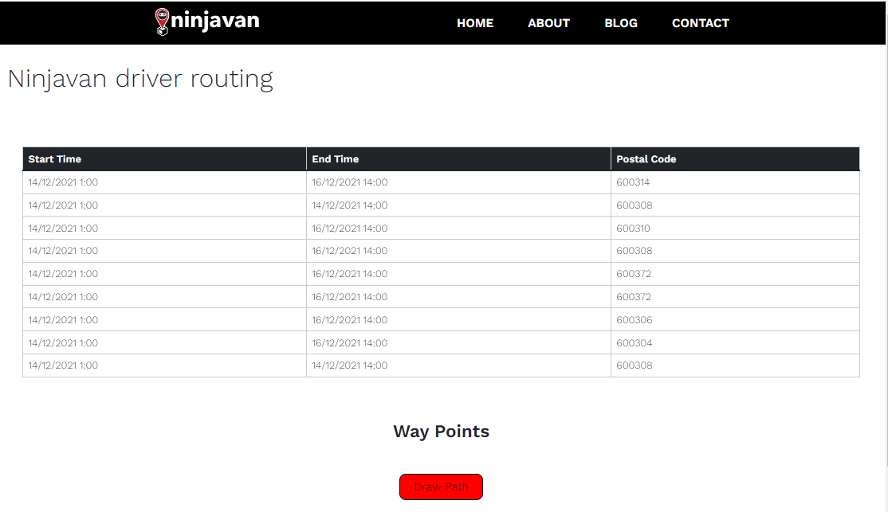

# Ninjavan driver routing by Team The Minions

* TAN TING CHER BENJAMIN (benjamintan.2020@scis.smu.edu.sg) 
* DARIEN TAN SHI FENG (darien.tan.2020@scis.smu.edu.sg) 
* LIM TZE HWEE (tsehwee.lim.2020@scis.smu.edu.sg) 
* CHEONG WEI SOON (wscheong.2020@scis.smu.edu.sg) 
# Project Overview
Our group, The Minions has decided to work on a solution for drivers, that would help ease their difficulties when traveling to one point to another. Thus, this web application will help solve this need.
# What it does
**The Minions** has coded a web application, that generates the schedule of the driver. This schedule is flexible and the driver can choose where they want to go, after the routes will be shown on the map to guide the driver on how to get there and the timings will be generated in a table below.
# Project Demo

